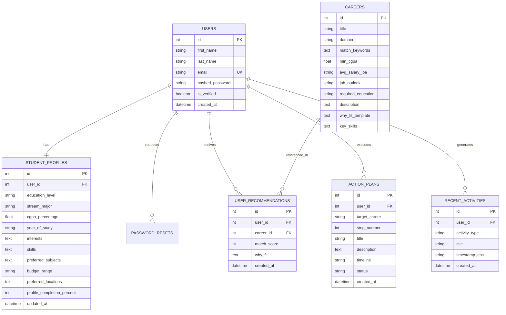

# Database Design: AI Student & Career Agent

## Entity-Relationship Diagram

```mermaid
erDiagram
    USERS ||--|| STUDENT_PROFILES : "has"
    USERS ||--o{ PASSWORD_RESETS : "requests"
    USERS ||--o{ USER_RECOMMENDATIONS : "receives"
    USERS ||--o{ ACTION_PLANS : "executes"
    USERS ||--o{ RECENT_ACTIVITIES : "generates"
    CAREERS ||--o{ USER_RECOMMENDATIONS : "referenced_in"

    USERS {
        int id PK
        string first_name
        string last_name
        string email UK
        string hashed_password
        boolean is_verified
        datetime created_at
    }

    STUDENT_PROFILES {
        int id PK
        int user_id FK
        string education_level
        string stream_major
        float cgpa_percentage
        string year_of_study
        text interests
        text skills
        text preferred_subjects
        string budget_range
        text preferred_locations
        int profile_completion_percent
        datetime updated_at
    }

    CAREERS {
        int id PK
        string title
        string domain
        text match_keywords
        float min_cgpa
        string avg_salary_lpa
        string job_outlook
        string required_education
        text description
        text why_fit_template
        text key_skills
    }

    USER_RECOMMENDATIONS {
        int id PK
        int user_id FK
        int career_id FK
        int match_score
        text why_fit
        datetime created_at
    }

    ACTION_PLANS {
        int id PK
        int user_id FK
        string target_career
        int step_number
        string title
        text description
        string timeline
        string status
        datetime created_at
    }

    RECENT_ACTIVITIES {
        int id PK
        int user_id FK
        string activity_type
        string title
        string timestamp_text
        datetime created_at
    }
```
