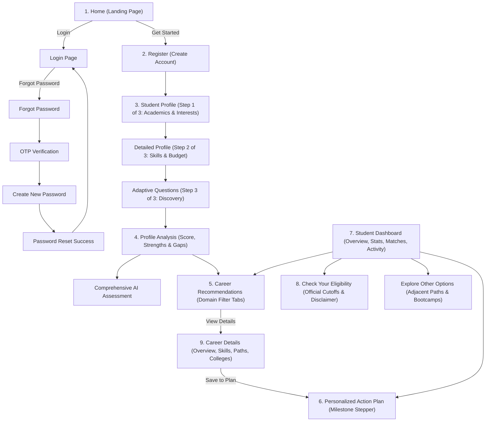

# Screen Flow: AI Student & Career Agent

```mermaid
flowchart TD
    Landing["1. Home (Landing Page)"] -->|Get Started| Register["2. Register (Create Account)"]
    Landing -->|Login| Login["Login Page"]
    Login -->|Forgot Password| Forgot["Forgot Password"]
    Forgot --> OTP["OTP Verification"]
    OTP --> NewPass["Create New Password"]
    NewPass --> ResetSuccess["Password Reset Success"]
    ResetSuccess --> Login

    Register --> ProfileStep1["3. Student Profile (Step 1 of 3: Academics & Interests)"]
    ProfileStep1 --> ProfileStep2["Detailed Profile (Step 2 of 3: Skills & Budget)"]
    ProfileStep2 --> ProfileQuestions["Adaptive Questions (Step 3 of 3: Discovery)"]

    ProfileQuestions --> ProfileAnalysis["4. Profile Analysis (Score, Strengths & Gaps)"]
    ProfileAnalysis --> ComprehensiveAI["Comprehensive AI Assessment"]
    ProfileAnalysis --> CareerRecs["5. Career Recommendations (Domain Filter Tabs)"]

    CareerRecs -->|View Details| CareerDetails["9. Career Details (Overview, Skills, Paths, Colleges)"]
    CareerDetails -->|Save to Plan| ActionPlan["6. Personalized Action Plan (Milestone Stepper)"]

    Dashboard["7. Student Dashboard (Overview, Stats, Matches, Activity)"]
    Dashboard --> CareerRecs
    Dashboard --> ActionPlan
    Dashboard --> Eligibility["8. Check Your Eligibility (Official Cutoffs & Disclaimer)"]
    Dashboard --> ExploreOptions["Explore Other Options (Adjacent Paths & Bootcamps)"]
```
