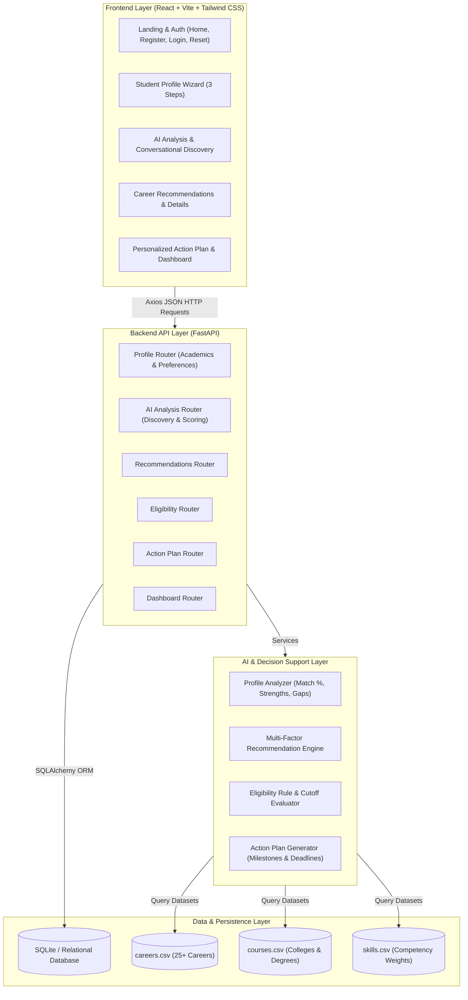

# System Architecture: AI Student & Career Agent

The AI Student & Career Agent is structured as a decoupled, multi-tier system with an interactive single-page application frontend, a high-throughput RESTful FastAPI backend, a multi-factor AI recommendation engine, and relational persistence.

## Data Flow Pipeline

1. **Understand**: Student enters academic information (CGPA, degree, year) and primary interests.
2. **Ask**: Agent asks dynamic conversational discovery questions to fill gaps in motivation, culture, and goals.
3. **Analyze**: AI scores profile completion, extracts top strengths, identifies growth areas, and computes match scores.
4. **Recommend**: Multi-factor scoring ranks career paths with transparent "Why this is a good fit" rationales.
5. **Explain**: System presents clear compensation projections, required skills, and growth outlook.
6. **Act**: System converts recommendations into a time-bound milestone action plan with counselor escalation options.
